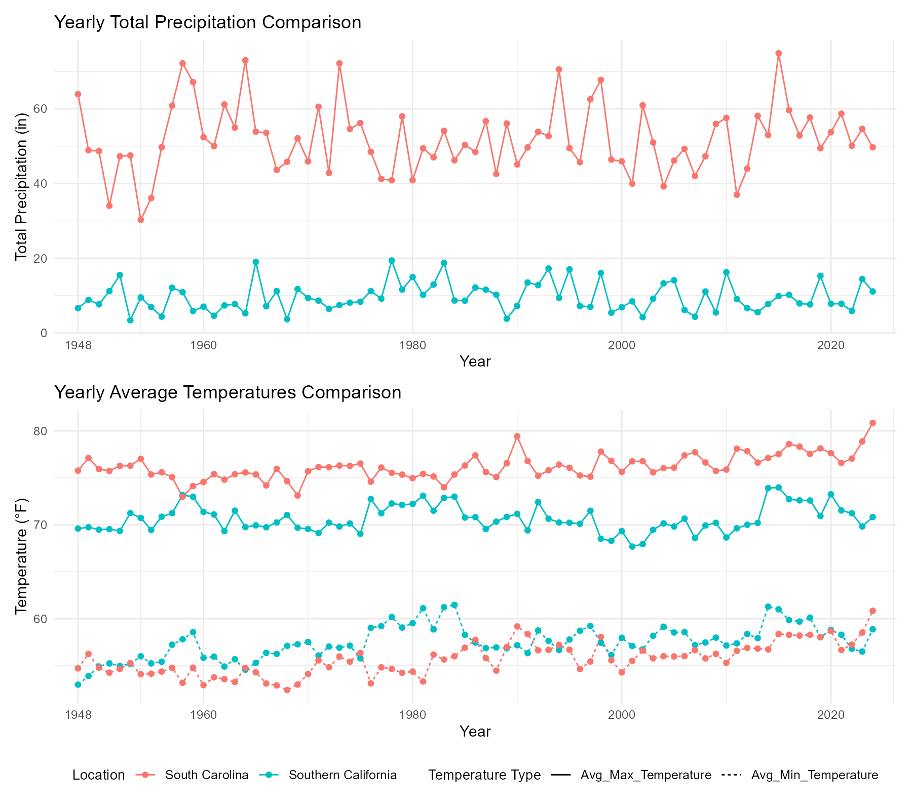
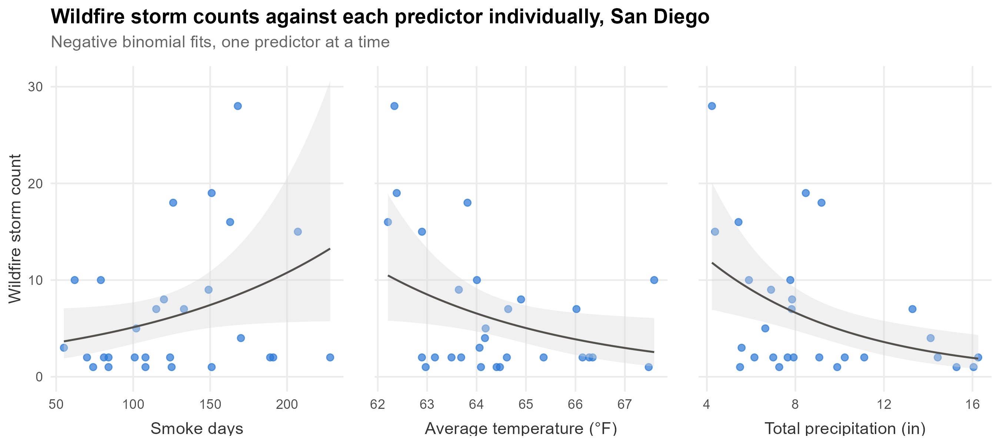
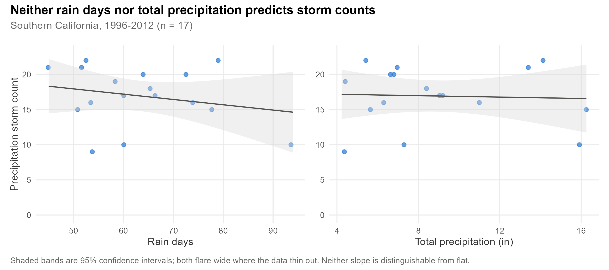
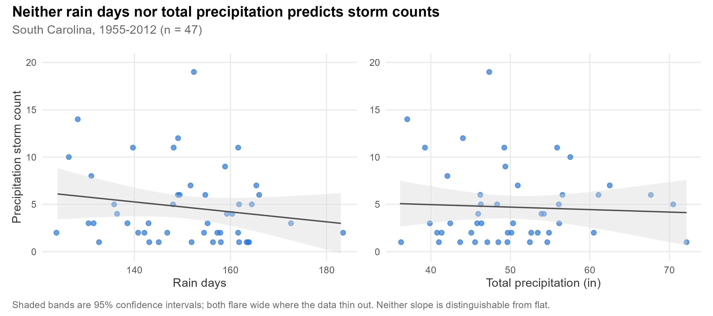

# Climate Change and Extreme Weather Events

Do local weather conditions predict extreme weather events? An analysis of NOAA
daily station records and storm event data for two climatically distinct
regions: San Diego, California (Mediterranean) and Charleston, South Carolina
(humid subtropical).

## Motivation

Rising temperatures, shifting rainfall, and intensifying storms are established
indicators of climate change, and research has linked them to increases in
wildfires and severe storms at a global scale. Less is understood about how
these relationships hold locally. This project tests whether the weather
variables a single station records (temperature, rain days, smoke days, total
precipitation) predict the extreme events logged in the same area.

The two regions were chosen for contrast. The hypothesis was that Charleston's
wetter climate would show a link between rainfall and precipitation-driven
storms, while San Diego's dry climate would show a link between dry conditions
and wildfires.

## Findings

**San Diego, wildfires:** supported. Wetter years have fewer wildfire storms.

**Both regions, precipitation and wind storms:** not supported. Neither rain
days nor total rainfall predicts storm counts.

Local weather explains a limited share of extreme weather activity, and the
larger drivers are not in this data.

## Data

[NOAA Climate Online Database](https://www.ncdc.noaa.gov/cdo-web/), four files:

| File | Coverage |
| --- | --- |
| `South Cali_daily_1945.csv` | San Diego daily station records, 1945 to present (29,167 days) |
| `South Carolina_daily_1937.csv` | Charleston daily station records, 1937 to present (32,033 days) |
| `South California Storm Event.csv` | San Diego storm events, 1950 onward |
| `South Carolina Storm Event.csv` | Charleston storm events, 1950 onward |

Daily records carry precipitation, temperature, and condition flags (fog,
smoke, thunder, rain). Storm events log discrete severe-weather occurrences
with begin and end dates.

## Method

Station data is reduced to the relevant variables and overlapping condition
flags are collapsed. Storm events are deduplicated, since the same storm is
logged once per reporting office, then matched to calendar days with an
interval join. Everything is aggregated to yearly totals.

Both outcomes are yearly counts, so ordinary least squares serves only as a
baseline. Each model is fit as OLS first and checked with residual, QQ, and
Shapiro-Wilk diagnostics. Where those fail, the model is refit as a Poisson GLM
and tested for overdispersion, the ratio of observed variance to what Poisson
assumes. A ratio above 1.5 means the standard errors are understated, so
negative binomial is reported instead. San Diego's precipitation-storm model
passes its diagnostics and stays OLS; the other two are negative binomial.

## Results

### Regional patterns

Charleston is wetter and more variable, with 0.14 in of precipitation per day
against San Diego's 0.026, and rain on 33% of days against 16%. San Diego
records smoke on 37% of days against Charleston's 26%, consistent with its
wildfire exposure.



### Wildfire storms, San Diego

Yearly wildfire counts for 1996-2023 (28 years) were regressed on smoke days,
average temperature, and total rainfall using a negative binomial model, chosen
because the counts vary about four times more than their mean.

Only rainfall mattered. Each additional inch of annual precipitation is
associated with roughly 13% fewer wildfire storms (coefficient -0.139,
p = 0.002). Smoke days (p = 0.92) and average temperature (p = 0.10) showed no
significant effect.

Each panel below fits a single predictor on its own; the reported model fits
all three together.



**Why 1996.** NOAA only catalogues all event types from that year, so wildfire
has no earlier rows.

### Precipitation and wind storms, both regions

Yearly counts of heavy rain, high wind, thunderstorm wind, and strong wind
events were regressed on rain days and total rainfall, each region separately.
San Diego used OLS (17 years, 1996-2012); Charleston used negative binomial
(47 years, 1955-2012).

Neither predictor was significant in either region: San Diego p = 0.34 and
p = 0.67 (R² = 0.066), Charleston p = 0.23 and p = 0.93.

The regions are plotted separately because storm events are logged per
reporting zone, and San Diego spans 12 against Charleston's 2, so its counts
run higher for reasons of geography. Fit lines are OLS in all four panels;
Charleston's reported model is negative binomial.





Additional figures (weather event counts, storm-day severity, model fit) are
written to `output/figures/` when the scripts run.

## Limitations

**Reporting coverage changes over time.** NOAA records grow denser across the
series as practices change, so part of any trend is artifact. The sharp decline
in recorded rain days after 2012 reflects reporting changes rather than
weather, and earlier records carry substantial gaps.

**Granularity mismatch.** Weather data captures daily station conditions while
storm events log large-scale severe occurrences, so the two are not measuring
the same thing.

**Narrow predictors.** Four variables explain storm counts here. Wind speed,
likely a stronger driver of wind-related storms, had too much missing data to
include.

**Reverse causation.** Smoke days are partly caused by the wildfires they are
used to predict, so that coefficient resists causal reading.

**Small samples.** Yearly aggregation leaves 17 to 47 observations per
precipitation model, which limits power. San Diego's null in particular rests
on thin evidence.

## Running it

```r
source("R/01_clean.R")   # load, clean, flag storm days
source("R/02_eda.R")     # yearly summaries and exploratory figures
source("R/03_models.R")  # regression models
```

Scripts run in order; each assumes the previous one's objects are in the
environment. R 4.x with `dplyr` (>= 1.1), `tidyr`, `ggplot2`, `lubridate`,
`patchwork`, `MASS`, `olsrr`.

```
R/               analysis scripts
data/raw/        NOAA CSVs
output/figures/  generated plots
```