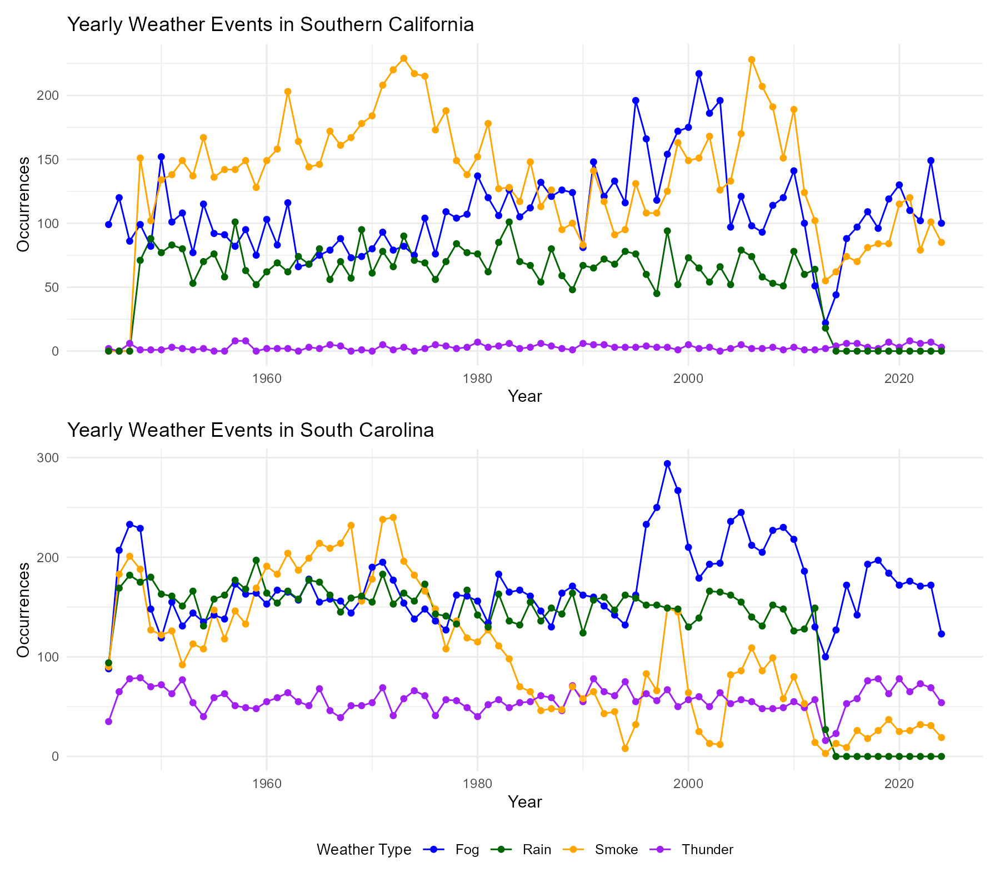
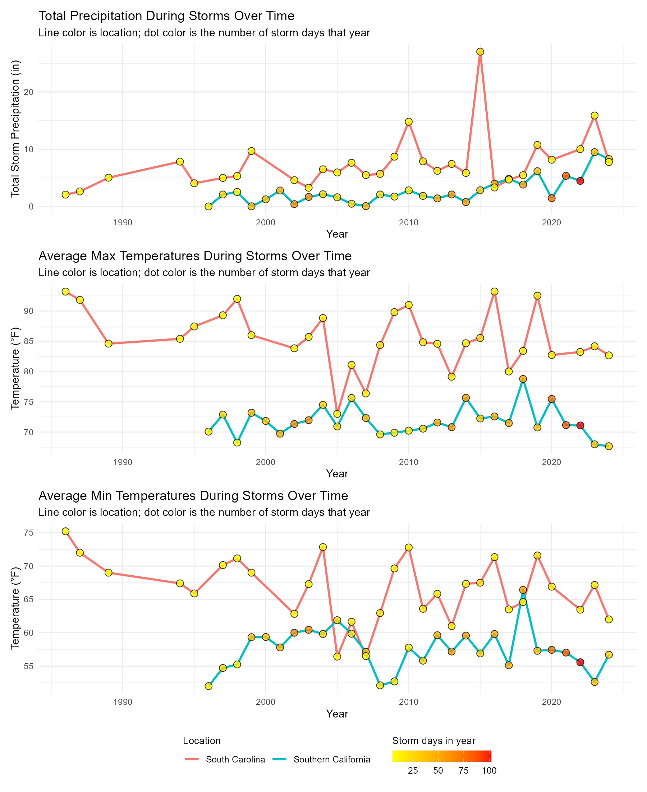
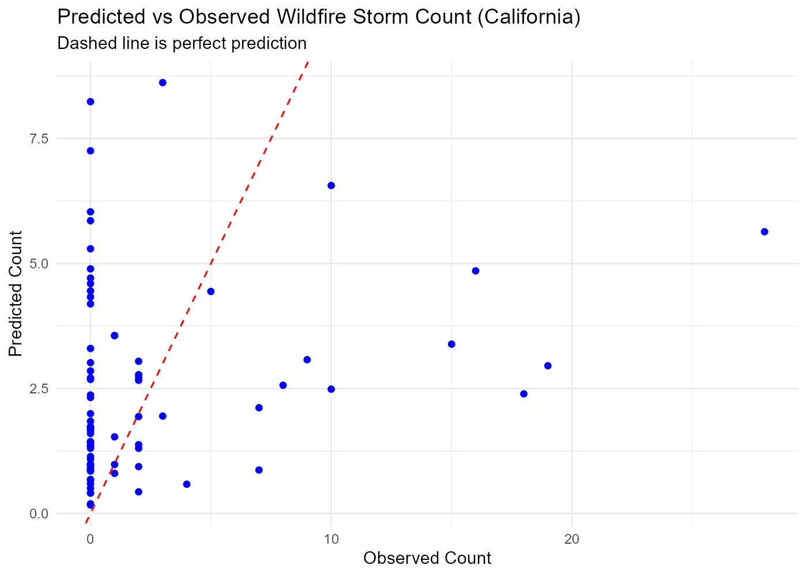
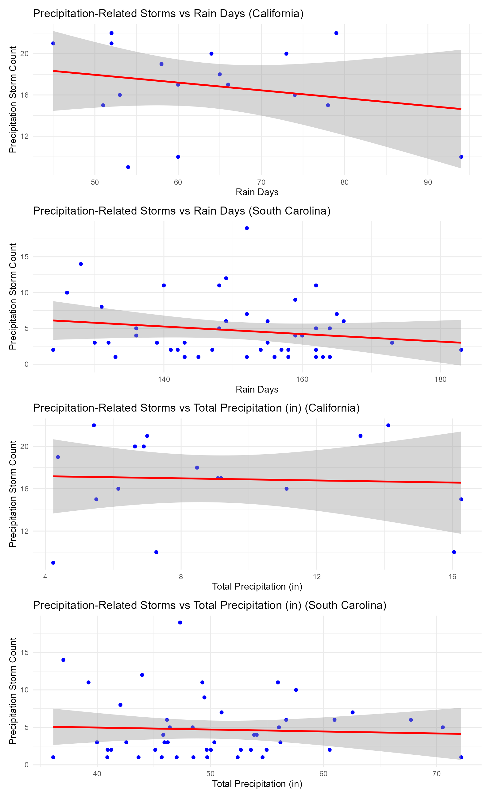
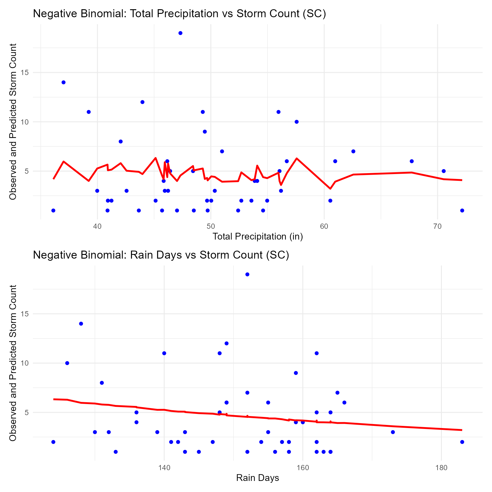

# Climate Change on Extreme Weather

Analysis of how weather patterns relate to extreme storm events in two
climatically distinct regions — San Diego, California (Mediterranean climate)
and Charleston, South Carolina (humid subtropical climate) — using NOAA daily
weather station records and NOAA Storm Events data.

## Data

Source: [NOAA Climate Online Database](https://www.ncdc.noaa.gov/cdo-web/).

| File | Description |
|---|---|
| `data/raw/South Cali_daily_1945.csv` | Daily weather station records, San Diego, CA (1945–present) |
| `data/raw/South Carolina_daily_1937.csv` | Daily weather station records, Charleston, SC (1937–present) |
| `data/raw/South California Storm Event.csv` | NOAA Storm Events records, San Diego area |
| `data/raw/South Carolina Storm Event.csv` | NOAA Storm Events records, Charleston area |

Daily station data includes precipitation, temperature, and weather-condition
flags (fog, smoke, thunder, rain, etc.). Storm event data logs discrete
severe-weather occurrences (wildfires, high wind, thunderstorm wind, heavy
rain) with begin/end dates and event type.

## Repo structure

```
R/
  01_clean.R    Load raw data, standardize columns, flag storm days
  02_eda.R      Yearly summaries and exploratory figures
  03_models.R   Regression models: wildfire storms and precipitation/wind storms
data/raw/       Raw NOAA CSVs (see Data above)
output/figures/ Generated plots (PNG), written by 02_eda.R and 03_models.R
```

Scripts are meant to be run in order — `02_eda.R` and `03_models.R` assume the
objects created by the previous script(s) are already in the environment:

```r
source("R/01_clean.R")
source("R/02_eda.R")
source("R/03_models.R")
```

## Method summary

**Cleaning (`01_clean.R`)** — Station data is reduced from NOAA's full column
set to the variables relevant here (precipitation, temperature, weather-type
flags), columns with excessive missingness are dropped, and overlapping
weather-type flags (e.g. Fog / Heavy Fog) are collapsed. Storm events are
deduplicated (the same storm is logged once per reporting office with minor
field differences) and joined against the daily station data to flag which
calendar days fall inside a storm event.

**Exploratory analysis (`02_eda.R`)** — Yearly aggregates (total
precipitation, average temperature, weather-event counts, storm-day severity)
are computed for both regions and visualized as comparative time series.

**Modeling (`03_models.R`)** — Two regression questions:
1. Do smoke days, temperature, and precipitation predict yearly wildfire
   storm counts in California?
2. Do rain days and total precipitation predict yearly precipitation/wind
   storm counts in either region?

Each is fit first as OLS, checked against residual/QQ diagnostics and a
Shapiro-Wilk normality test, and refit as a Poisson or negative binomial GLM
when the outcome is an overdispersed count or the OLS residuals fail
normality.

## Requirements

R (4.x) with: `dplyr`, `tidyr`, `ggplot2`, `lubridate`, `patchwork`, `MASS`,
`olsrr`.

## Results

### Regional climate patterns

South Carolina's humid subtropical climate shows higher, more variable
precipitation and temperature, with more fog, rain, and thunder days.
Southern California's Mediterranean climate is drier and more thermally
stable, with far more smoke days — consistent with its wildfire exposure.
Both regions trend warmer over the multi-decade record.





### Wildfire storms (California)

Yearly wildfire storm counts (NOAA Storm Events) regressed against smoke
days, average temperature, and total precipitation, using all years with
recorded smoke days — including years with zero wildfire storms (see the
methodological note below on why that matters).

- **Total precipitation** is the only significant predictor (negative
  binomial GLM: coefficient −0.19, p = 0.010) — more rain in a year is
  associated with fewer wildfire storms.
- **Smoke days and average temperature are not significant** predictors once
  zero-wildfire years are included.
- The response is heavily overdispersed (ratio ≈ 8), so a negative binomial
  GLM is used instead of OLS/Poisson.




### Precipitation/wind storms (both regions)

Yearly precipitation/wind storm counts regressed against rain days and total
precipitation (years capped at 2012, when rain-flag recording becomes
unreliable at both stations — see `02_eda.R`).

- Neither rain days nor total precipitation significantly predicts storm
  counts in California (R² = 0.07) or South Carolina (R² = 0.03).
- South Carolina's response is also overdispersed; a negative binomial
  refit doesn't change the conclusion.
- Rainfall volume alone doesn't explain these storm counts well — other
  unmeasured factors (e.g. wind speed, not available in this dataset) are
  likely bigger drivers.




### Methodological note

An earlier version of the wildfire model built its modeling frame by joining
onto the wildfire-event table itself, which only contains years with at
least one recorded wildfire storm. That silently excluded every zero-wildfire
year, truncating the response and inflating both R² (0.39 vs. the corrected
0.077) and the apparent significance of average temperature as a predictor.
The corrected model joins onto the full set of years with recorded smoke
days (77 vs. 29 rows), explicitly filling missing wildfire counts with 0 —
a reminder that the direction of a join can bias a regression as much as any
modeling choice downstream of it.
